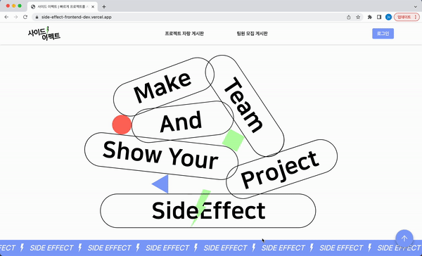
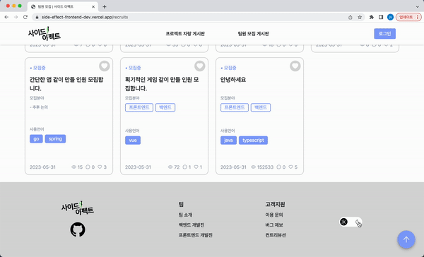
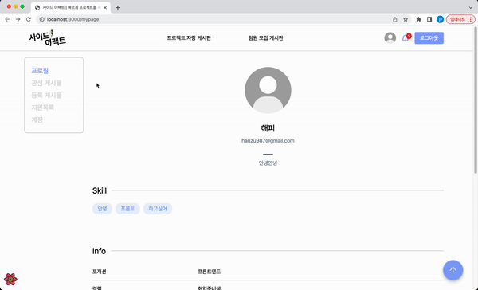
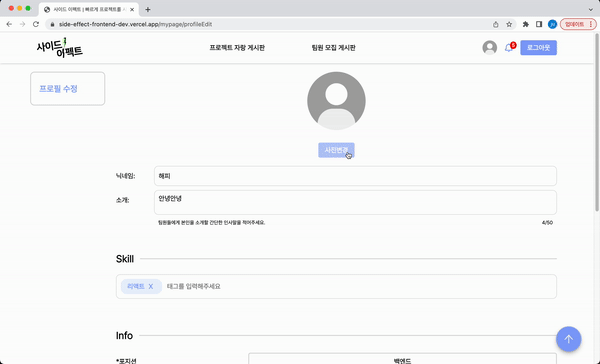
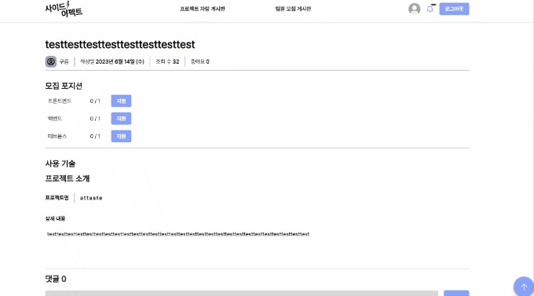
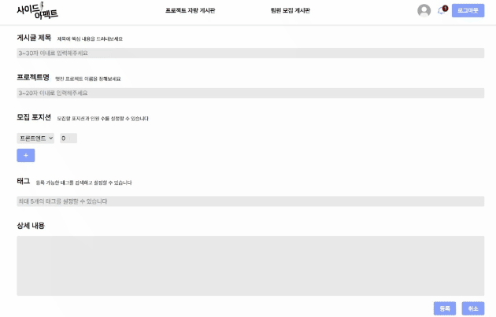
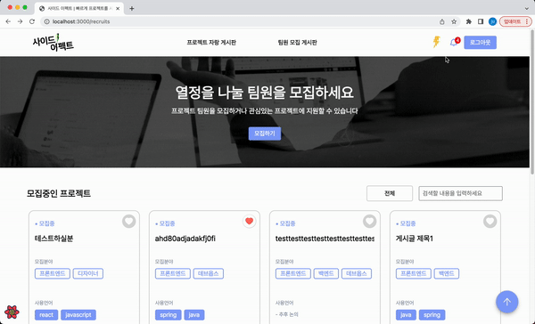
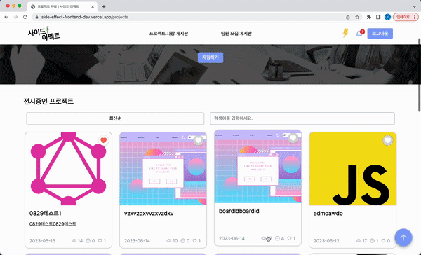

<div style="display: flex;justify-content: center"></div>

<h3>열정을 함께할 동료가 필요할 때, 사이드 이펙트</h3>
<p>개발자, 디자이너 등 누구나 쉽게 프로젝트를 시작하고, 네트워킹할 수 있는 커뮤니티 플랫폼입니다</p>

[서비스 구경하기](https://side-effect-frontend-dev.vercel.app/)

[팀 소개](https://github.com/Side-Effect-Team)

[백엔드 레포](https://github.com/Side-Effect-Team/side-effect-backend)

<br>

## 🛠️ 기술 스택

<div>


</div>
<br>


## 🌳 폴더 구조

```
.
├─apis : 백엔드 API 호출 함수 모음
│
├─components : 공용 컴포넌트 및 페이지 컴포넌트 모음
│  ├─Alarm
│  ...
│  ├─pages : 각 페이지를 구성하는 컴포넌트
│  │  ...
│  │  └─recruits
│  ...
│  └─Toast
│
├─enum : 문자열 상수화를 위한 데이터 모음
│
├─hooks : React Custom Hooks 및 React Query Hooks 모음
│  ├─common : React Custom Hooks
│  ├─mutations : mutation hooks
│  └─queries : query hooks
│
├─pages : Next.js 의 pages 라우팅 폴더
│
├─public : 앱의 정적 파일 (이미지)
│
├─store : Redux store 및 slice 모음
│
├─styles : Styled-components의 theme 및 글로벌 스타일 모음
│
├─types : API 반환값 type 모음
│
└─utils : 유틸리티 함수 모음

```

## 💻 주요 기능 및 페이지 소개

<table>
	<tbody>
		<tr>
			<th>랜딩 페이지</th>
			<th>다크모드 기능</th>
		</tr>
		<tr>
			<td></td>
			<td></td>
		</tr>		
		<tr>
			<td>- 모든 페이지에서 반응형 UI 지원<br>- 해당 서비스의 특징 및 사용법 안내<br>- 실시간 인기게시글 확인</td>
			<td>- 모든 페이지에서 다크모드 지원</td>
		</tr>	
		<tr>
			<th>로그인 페이지</th>
			<th>회원가입 하기</th>
		</tr>
		<tr>
		<td></td>
			<td></td>
		</tr>
		<tr>
			<td>- 로그인 반응형 모달<br>- 소셜 로그인 기능</td>
			<td>- 회원가입 기능<br>-  기능</td>
		</tr>
		<tr>
			<th>마이 페이지</th>
			<th>프로필 변경하기</th>
		</tr>
		<tr>
			<td></td>
			<td></td>
		</tr>
		<tr>
			<td>- 개인 프로필 관리<br>- 관심 게시글 및 작성 게시물 모아보기<br>- 지원 현황 및 상태 확인<br>- 계정 탈퇴 기능</td>
			<td>- 아바타 이미지 변경 기능<br>- 본인을 나타내는 해시태그<br>- 포지션, 경력 등의 정보 추가 및 수정 기능</td>
		</tr>
		<tr>
			<th>프로젝트 자랑 게시글 작성하기</th>
			<th>팀원 모집 게시글 상세 페이지</th>
		</tr>
		<tr>
			<td></td>
			<td></td>
		</tr>
		<tr>
			<td>- 잘못된 데이터 입력을 에러 메시지로 경고<br>- 프로젝트 대표이미지 등록 가능</td>
			<td>- 모집중인 포지션에 지원 가능<br>- 게시글 작성자인 경우 수정/삭제 가능<br>- 댓글 등록 및 수정, 삭제 가능</td>
		</tr>
		<tr>
			<th>팀원 모집 게시판 페이지</th>
			<th>팀원 모집 게시글 작성하기</th>
		</tr>
		<tr>
			<td></td>
			<td></td>
		</tr>
		<tr>
			<td>- 게시글을 무한 스크롤 형태로 빠르게 로딩<br>- 원하는 기술 태그 또는 내용의 게시글 검색</td>
			<td>- 팀원 모집 게시글 작성 기능<br>- 모집할 포지션 설정 및 기술 태그 검색 후 추가</td>
		</tr>
				<tr>
			<th>알람 이벤트</th>
			<th>게시물 관심목록 추가</th>
		</tr>
		<tr>
			<td></td>
			<td></td>
		</tr>
		<tr>
			<td>- 댓글 발생 알람 기능<br>- 모집 게시판 참여자 발생 알람 기능</td>
			<td>- 마이페이지 관심 목록 추가 기능</td>
		</tr>
		<tr>
			<th>팀 관리 모달</th>
			<th>스켈레톤 컴포넌트</th>
		</tr>
		<tr>
			<td></td>
			<td></td>
    	<tr>
    	<tr>
    		<td>- 지원자 관리 및 팀원 관리 반응형 모달</td>
			<td>- 레이아웃 시프트 방지를 위한 스켈레톤 컴포넌트</td>
    	</tr>
    </tbody>

</table>

<br>

## 🧑‍💻 만든 사람들

이름순

<table>
	<tbody>
		<tr>
			<th></th>
			<th></th>
			<th></th>
		</tr>		
		<tr>
			<th><a href="https://github.com/jong-k" target="_blank">김종한</a></th>
			<th><a href="https://github.com/taejinii" target="_blank">정태진</a></th>
			<th><a href="https://github.com/ju-ju2" target="_blank">한주연</a></th>
		</tr>	
	</tbody>
</table>
